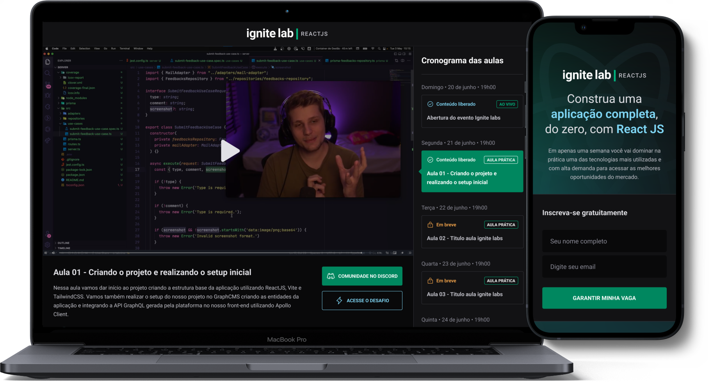

<h1 align="center">
  
  
</h1>

 

  

  <a href="#-layout">Layout</a> •
  <a href="#-technologies">Technologies</a> •
  <a href="#-license">License</a>

  

## 🔖 Layout

You can view the project layout through the link below:

- [Plataforma de evento - Ignite Lab](https://www.figma.com/community/file/1120711251998877938)

Remembering that you need to have a [Figma](http://figma.com/) account to access it.

## 🚀 Technologies

- [ReactJS](https://reactjs.org/)
- [Vite](https://vitejs.dev/)
- [React Router](https://reactrouter.com/)
- [TypeScript](https://www.typescriptlang.org/)
- [GraphQL](https://graphql.org/)
- [Apollo Client](https://www.apollographql.com/docs/)
- [Tailwindcss](https://tailwindcss.com/)
- [GraphQL Code Generator](https://www.graphql-code-generator.com/)

## 📝 License

This project is licensed under the MIT License - see the [LICENSE](LICENSE) file for details.

---

  Made with 💜 by <a href="https://www.linkedin.com/in/eliasgcf/">Elias Gabriel</a>

